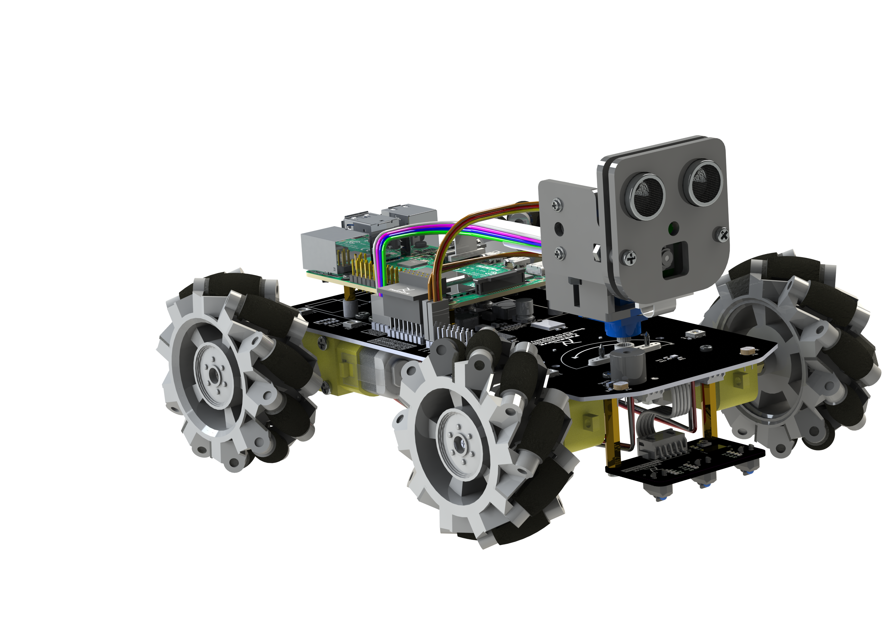
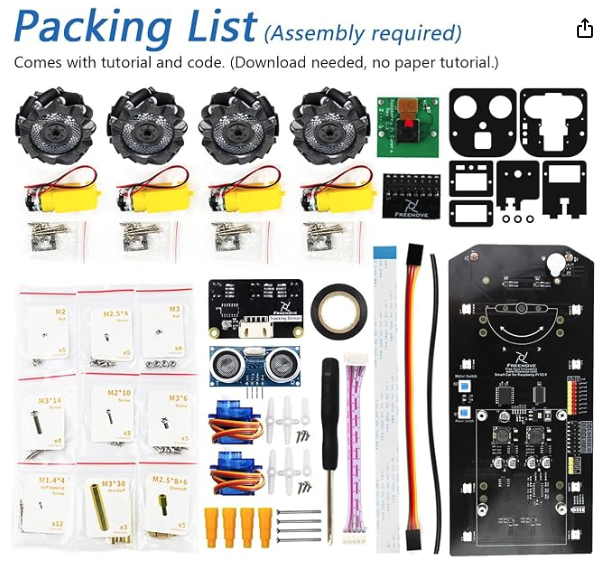

# Auto Inteligente con Raspberry Pi 5

El Freenove Mecanum Wheel Car Kit para Raspberry Pi 5 es un completo y versátil kit educativo diseñado para introducir a estudiantes, entusiastas y desarrolladores en el mundo de la robótica, la programación y la electrónica. Este vehículo inteligente se caracteriza por el uso de ruedas Mecanum, que le permiten moverse en cualquier dirección —adelante, atrás, lateralmente e incluso en diagonal— gracias a su sistema de tracción omnidireccional.

El kit integra múltiples componentes, como motores controlados por PWM, sensores ultrasónicos para evitar obstáculos, control remoto vía Wi-Fi o Bluetooth, y una plataforma basada en Raspberry Pi 5, lo que permite ejecutar scripts en Python y expandir las capacidades del robot con inteligencia artificial, visión por computadora, y más.

Este proyecto es ideal para fomentar el aprendizaje práctico en áreas como la programación de sistemas embebidos, Internet de las Cosas (IoT), automatización y robótica avanzada, promoviendo la creatividad, la resolución de problemas y el trabajo interdisciplinario.

## Arquitectura del Auto Inteligente



## Componentes (materiales)



# Autopi o auto inteligente

Nuestro auto inteligente está compuesto por un vehículo inteligente 4WD con ruedas Mecanon y una raspberry pi 5 qué es el cerebro principal que filtra la información al al módulo ultrasónico del auto para que realice las funciones enviadas desde el control remoto en
este caso nosotros usaremos la app que es Freenove que por medio de Bluetooth y Wi-Fi realiza las funciones y movimientos deseados.

¿Por qué utilizamos una Rasberry pi 5 en este caso?
Esta nos ofrece potencia de procesamiento, conectividad mejorada y soporte para múltiples sistemas operativos, lo
que lo hace ideal para controlar motores, datos de sensores y ejecutar algoritmos de inteligencia artificial en tiempo y forma.
Este magnífico proyecto está compuesto por:
Chasís 4WD en esta estructura va a ensamblada los cuatro controladores de motor (cómo TK6612tNG) qué sirve para manejar la velocidad de los motores , en estos va ensamblados las cuatro ruedas Mecanum que tiene la capacidad de moverse omnidireccional menté las ruedas son colocadas en forma de X que permite que este se mueva en cualquier dirección (cruzada, girar, lateral ,etc.)
Los motores van conectados a dos pilas recargables de litio 18650 de 3.7 con corriente de
descarga continua >3A .

En la parte inferior frontal tenemos los sensores y contienen detectores de obstáculos y
seguimiento de línea usando sensores LED infrarrojos y el módulo de matriz de punto
éste sirve para mostrar textos números o gráficos y se controla a través de un Arduino. Se
va conectado al módulo ultrasónico este es un pequeño dispositivo que recibe las ondas
ultrasónicas, para medir distancia, detectar objetos o determinar niveles de líquido este va
conectado a los pines 4PIO qué tiene la placa en la parte superior trasera en estos pines
también va conectada la Raspberry Pi 5 lo que permite que la información se filtre al módulo ultrasónico esto los sensores todo esto siendo controlado desde la app ya antes mencionada  FREEOVER y inteligencia artificial.
Las principales conexiones del robot son:

* Conexión de motores a los Drivers.
* Conexión de los Drivers a los pines 4PIO De la Raspberry pi 5.
* La conexión de batería al Drivers del motor(no directamente a la Raspberry pi 5 .

Se utilizaron los siguientes software:

* El sistema operativo de la Raspberry pi 5.
* Lenguaje de Python .
* OpenCV(para visión por computadora.)
* Pgame oh interfaz web(para control remoto)
* Lopsionalls RQS por si quieren navegación autónoma.

## Objectivo

El objetivo del robot es ayudar a los estudiantes a poner en práctica las habilidades en robótica y programación.

A este proyecto el aporte que le haríamos sería de reproducir los sonidos del entorno que lo rodea en el control remoto y usarlo en caso de investigaciónes privadas.

## Configuración/Controladores

Ir al directorio en el cuál se encuentra el código fuente:

```
cd ~/Freenove_4WD_Smart_Car_Kit_for_Raspberry_Pi/Code/Server
```

### Motor

Prueba de motor ,esta sirve para corroborar que los motores funcionen
correctamente moviendo las ruedas MECANUM , omnidireccionales
para que el auto pi se pueda desplazar en cualquier dirección derecha,izquierda,
adelante ,atrás y en circulo etc.

```
sudo python test.py Motor
```

### Sensor led de seguimiento de línea

Prueba del sensor de seguimiento de linea, este esta ubicado en la parte frontal superior
del chasis este nos ayuda a detectar si en la superficie que se encuentra hay alguna linea, para que
al momento de dar la orden seguirla , contiene tres LED que detectan si la linea esta
ala derecha ,izquierda o al centro.
sensor.
Enter the following command in the terminal to test line tracking module. If the terminal
displays the directory as below (where test.py is located), you can directly execute the
test.py command. 1. If not, execute the cd command:  

```
sudo python test.py Infrared
```

### ADC

Nos dice el voltaje que tiene batería del autopi.
ADC Module Run program Enter the following commands to test ADC module. If the
terminal displays the directory as below (where test.py is located). You can directly
execute the test.py command. 1. If not, execute the cd command: cd

```
sudo python test.py ADC
```

### Luces led

Las luces LED ,son para que el auto sea más llamativo a los ojos de las personas y captar
su atención.

Run program Enter the following commands to test LEDs. If the terminal displays the
directory as below (where test.py is located), you can directly execute the test.py
command.

```
sudo python test.py Led
```

### Buzzer

Produce un sonido en el autopi.

```
sudo python test.py Buzzer
```

### Modulo ultrasonico

Detecta la distancia que hay frente al autopi. Lo máximo es de 3 metros delongitud.
Comando:

```
sudo python test.py Ultrasonic
```

### Servo

Mueve la cátmara los y los sensores.
If not, execute the cd command: cd

```
sudo python test.py Servo
```

### Cámara

La Cámara sirve para ver lo que se encuentra al frente y puede detectar rostros.

```
python camera.py
```

### EXTRA

1. If not, execute the cd command: cd

```
sudo python car.py Light
````

Comandos de linux utilizados en el proyecto
Un conector que conecta la pi ala tarjeta del robot .
Sevos que mueven la cámara y los censores .

Ls . alista archivos y directorios .( demuestra una lista con archivos y directorios que hay
dentro del directorio actual en el que estás.)

Cd . cambiar directorio .

cd.. vas al documento padre. Esto quiere decir que si estás en una azúcar carpeta,
pasarás a la carpeta anterior del que estabas.

cd- vas al directorio anterior en el que estabas por ejemplo, si estás haciendo algo en uno
y luego salta al otro totalmente diferente para hacer una tarea concreta, con este vuelves
al que estabas antes.

Pwd. Directorio actual saber dónde está . ( te muestra el directorio en el que estás ahora
mismo, y así poder saber la estructura de directorio del sistema en el que estás.

VNC . Sirve para controlar la computadora remotamente .

SSH terminal remota .

### Primera fase

Paso 1 Ping autopi
Paso 2 vnc 192.168.110.39

### Segunda Fase

```
ls
cd Fre Tab
ls
cd code
ls
cd server
ls
MOTOR sudo python test.py Motor
SENSOR DE SEGUIMIENTO DE LÍNEA . sudo python test.py Infrared
ADC sudo python test.py ADC
LUCES LED sudo python test.py Led

BUZZER sudo python test.py Buzzer
MODULO ULTRASONICO sudo python test.py Ultrasonic
SERVO sudo python test.py Servo
CÁMARA python camera.py
EXTRA sudo python car.py Light
sudo python car.py Sonic
sudo python car.py Infrared
APAGAR. Shutdowd -h now
```
