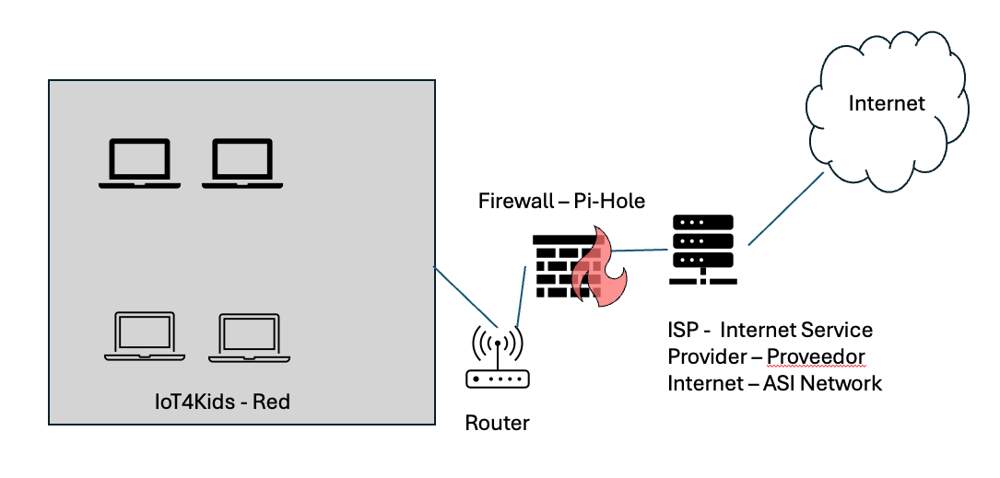
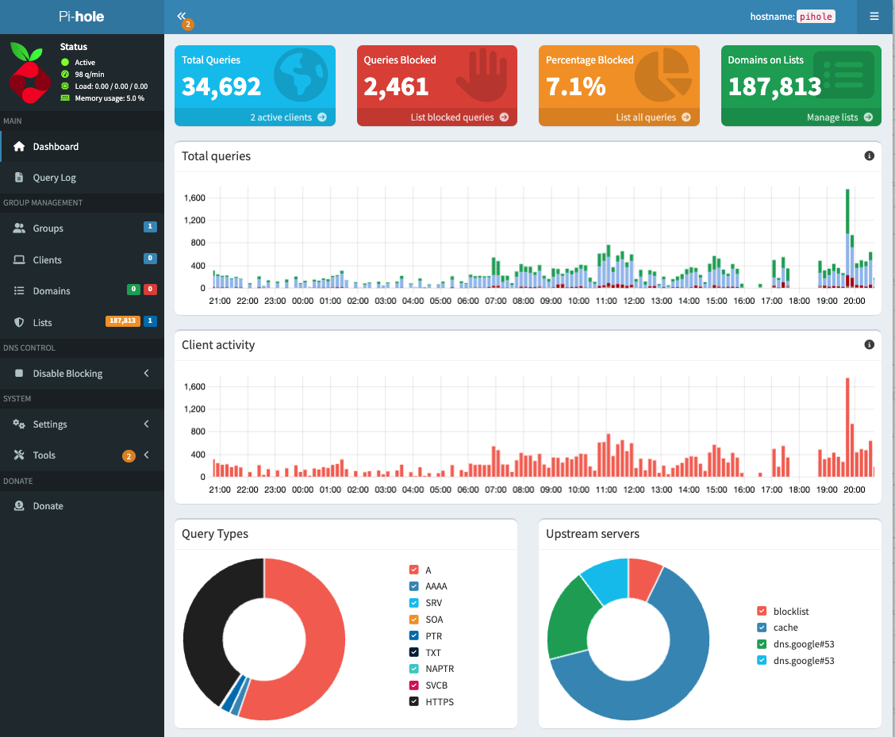

# Bloqueador de anuncios

Pi-hole es una aplicación de bloqueo de anuncios y rastreadores de Internet a nivel de red para Linux, que actúa como un sumidero DNS (DNS sinkhole) y, opcionalmente, como un servidor DHCP, destinada para su uso en una red privada. Está diseñada para funcionar en dispositivos integrados de bajo consumo con capacidad de red, como la Raspberry Pi, aunque puede instalarse en prácticamente cualquier máquina con Linux.

Pi-hole tiene la capacidad de bloquear anuncios tradicionales en sitios web, así como anuncios en lugares no convencionales, como televisores inteligentes y sistemas operativos móviles. También puede configurarse para bloquear sitios web específicos o aplicar controles parentales.

Pi-hole tiene la capacidad de bloquear anuncios tradicionales de sitios web, así como anuncios en lugares no convencionales, como televisores inteligentes y sistemas operativos para dispositivos móviles.

# Objetivos

• Monitorear el tráfico de red  

• Bloquear anuncios

• Bloqueo de rastreadores

• Control parental

• Aceleración de navegación

• Protección de privacidad

• Asignación de DNS local

Pi-hole tiene como principal objetivo actuar como un bloqueador de anuncios y rastreadores a nivel de red, lo que significa que protege a todos los dispositivos conectados a la red sin necesidad de instalar extensiones en cada uno de ellos.

Pi-hole es un software que se ejecuta en una Raspberry Pi (técnicamente, puede ejecutarse incluso fuera de una Pi) y que actúa como proxy del Servicio de Nombres de Dominio (DNS) dentro de tu propia red . Es decir, si accedes a [nombre https://example.comdel dominio], primero accede a Pi-hole antes de solicitar información del dominio a servidores DNS autorizados. Su objetivo principal es bloquear las solicitudes a dominios que no quieres que accedan desde tu red. Estos pueden ser rastreadores, redes de distribución de contenido (CDN) que sirven anuncios o cualquier dominio que consideres inapropiado para recibir datos de tu casa o lugar de trabajo.

Además, también puedes configurar reglas para bloquear dominios que cumplan ciertos criterios mediante expresiones regulares. Por ejemplo, dado que veo mucho tráfico malicioso procedente de Rusia, China y Hong Kong, puedo bloquear fácilmente esos TLD:

(^|\.)(cn|ru|hk)$  

Interfaz web

Imagen 1, PictureAdemás de bloquear anuncios, Pi-hole cuenta con una interfaz web informativa que muestra estadísticas de todos los dominios consultados en su red.

Curiosamente, Pi-hole también incorpora un servidor DHCP integrado (dnsmasqd) que se puede configurar a través de su interfaz de administración. Supongo que la integración del servidor DHCP buscaba simplificar la configuración de los servidores DNS de los clientes , pero resulta muy práctico para redes domésticas.

La gente puede confundir pi hole con pi adblock y lo cual no son iguales, aunque ambos estan relacionados con el bloqueo de anuncios.Pi-hole es un sistema completo para bloquear anuncios a nivel de red, mientras que “Pi Adblock” parece ser un término general o una extensión específica para el bloqueo de anuncios en navegadores o aplicaciones.  

## Diagrama

## Dashboard

