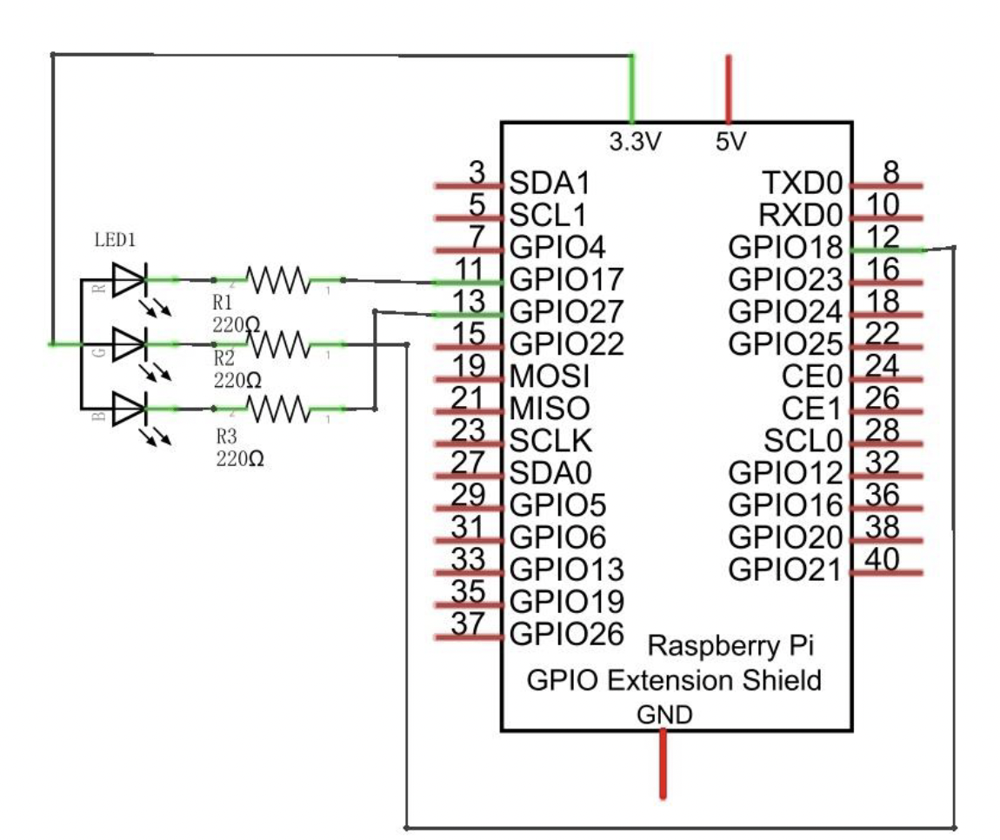
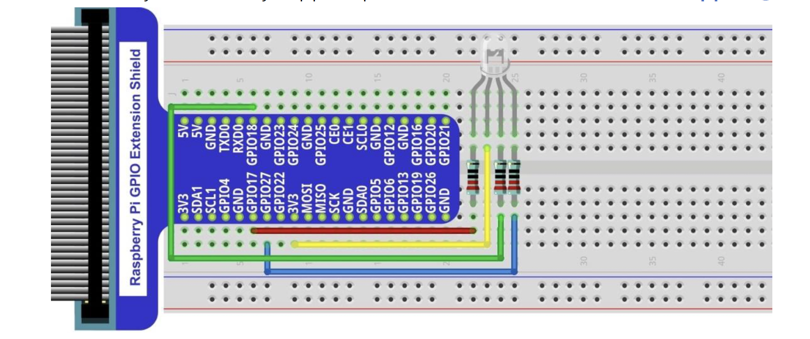

# Led Multicolor

Este proyecto tiene como objetivo controlar un LED RGB (multicolor) utilizando un microcontrolador como Arduino, Raspberry Pi o una placa compatible, permitiendo generar una amplia gama de colores mediante la combinación de los canales rojo, verde y azul.

El sistema permite modificar la intensidad de cada color mediante señales PWM (modulación por ancho de pulso), logrando efectos visuales como transiciones suaves, parpadeos sincronizados, o cambios de color automáticos y programables. Además, se pueden incluir controles físicos (como botones o potenciómetros), sensores (como de luz o movimiento) o control remoto vía Bluetooth/Wi-Fi para una experiencia más interactiva.

Este proyecto es ideal para aprender conceptos básicos de circuitos eléctricos, programación de microcontroladores, y efectos visuales, siendo una excelente introducción al mundo del hardware interactivo y el diseño de iluminación creativa.

Proyecto: Luces LED Multicolor con Raspberry Pi
Explicación del Proyecto:
Este proyecto consiste en conectar luces LED RGB (que pueden mostrar diferentes colores) a una
mini computadora llamada Raspberry Pi.
Utilizamos programación en Python para controlar el encendido, los colores y los patrones de las
luces, como parpadeos, cambios suaves de color y combinaciones específicas.
Los LEDs RGB tienen tres pines que controlan el rojo, el verde y el azul. Al variar la intensidad de
cada uno mediante señales PWM (modulación por ancho de pulso), podemos crear diferentes
colores.
Todo esto se maneja a través de los pines GPIO (General Purpose Input/Output) de la Raspberry
Pi.
¿Para qué se usa este tipo de proyecto?

- Para aprender a programar de forma práctica y visual.
- Para introducirse en la electrónica básica.
- Para comprender cómo funcionan los sistemas embebidos y los controles automáticos.
- Para explorar la automatización del hogar mediante sistemas de iluminación inteligentes.
- En la creación de ambientes personalizados, efectos visuales, o decoraciones interactivas.
Otros proyectos posibles con Raspberry Pi y luces LED:

1. Semáforo inteligente: Programar un semáforo funcional con sensores de paso.
2. Sistema de alarma visual: Encender una luz roja si se detecta movimiento con sensores.
3. Lámpara controlada por voz: Cambiar el color de las luces mediante comandos hablados.
4. Luces sincronizadas con música: Los LEDs parpadean al ritmo de canciones.
5. Decoración ambiental programable: Diseñar patrones de luces para navidad, fiestas o
habitaciones temáticas.
Conclusión:
Este proyecto es ideal para comenzar a trabajar con hardware y software de manera integrada.
Además de ser educativo, es creativo y puede aplicarse en muchas situaciones reales, como
iluminación inteligente, decoración y enseñanza en tecnología.

## Esquema

## Diagrama

