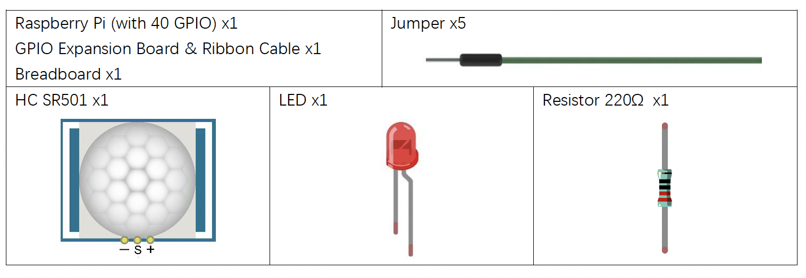
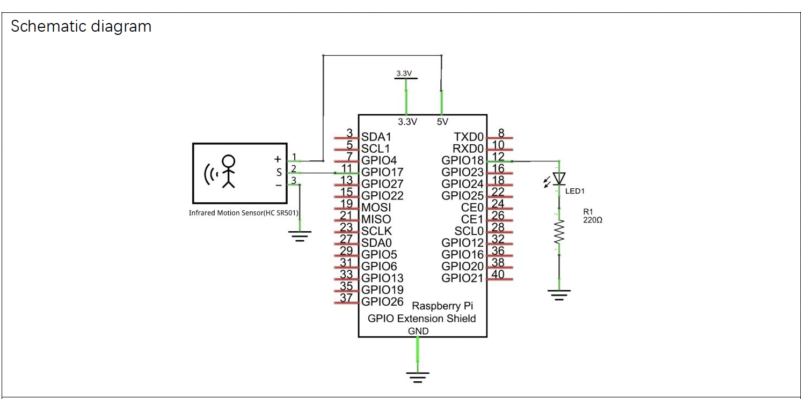
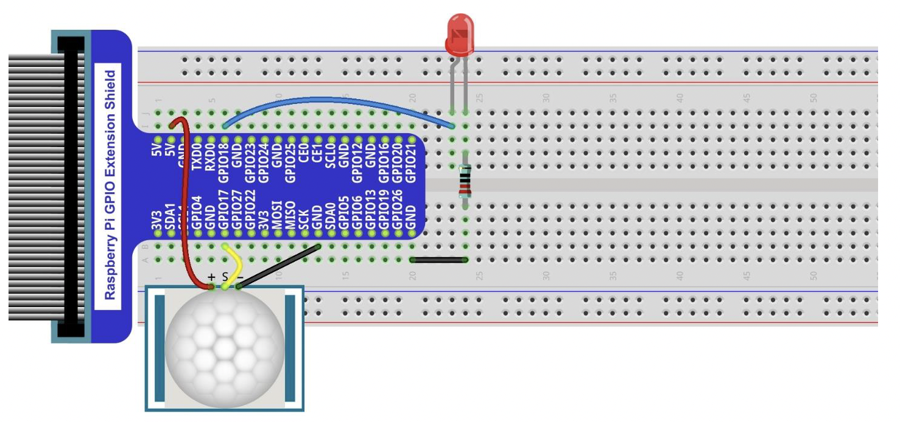
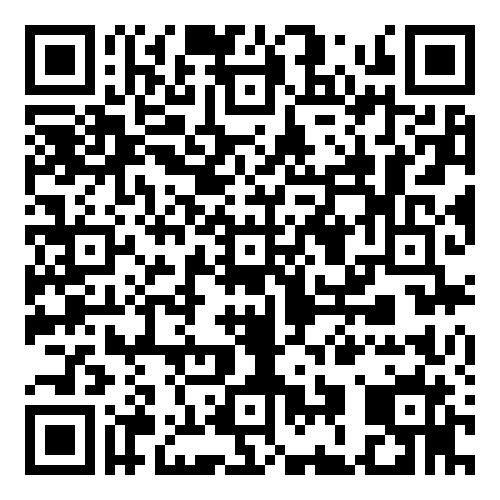

# Sensor de Movimiento Infrarojo

En este proyecto, crearemos un Detector de Movimiento utilizando sensores piroeléctricos infrarrojos del cuerpo humano.
Cuando alguien se acerque al Detector de Movimiento, este se encenderá automáticamente, y cuando no haya nadie cerca, se apagará.
Este Sensor de Movimiento Infrarrojo puede detectar el espectro infrarrojo (firmas de calor) emitido por seres humanos y animales vivos.

## Descripción

Descripción:

Voltaje de funcionamiento: 5V-20V (DC)
Corriente estática: 65uA

Disparo automático: Cuando un cuerpo vivo entra en el área activa del sensor, el módulo emitirá una señal de nivel alto (3.3V).
Cuando el cuerpo abandona el área de detección activa del sensor, este mantendrá la salida en nivel alto durante un periodo de tiempo T, y luego cambiará a nivel bajo (0V).
El tiempo de retardo T puede ajustarse mediante el potenciómetro R1.

Tiempo de bloqueo de inducción: Después de emitir una señal de nivel alto o bajo, el sensor entra en un estado de bloqueo y no detecta señales externas durante intervalos de tiempo menores al tiempo de retardo.

Tiempo de inicialización: El módulo necesita aproximadamente 1 minuto para inicializarse después de ser encendido. Durante este período, alternará entre salidas de nivel alto y bajo.

Una característica de este sensor es que cuando un cuerpo se acerca o se aleja del borde de la cúpula del sensor, este funciona con alta sensibilidad. Sin embargo, cuando un cuerpo se mueve en dirección vertical (perpendicular a la cúpula), el sensor no detecta bien (tenga en cuenta esta limitación). Esto es razonable si consideramos que este sensor generalmente se instala en el techo como parte de un sistema de seguridad.
Nota: El rango de detección (distancia a la que se detecta un cuerpo) se ajusta con el potenciómetro.
Podemos considerar este sensor como un interruptor inductivo simple durante su uso.

## Materiales

## Diagrama de el GPIO

## Diagrama de el Breadboard

## Codigo QR

