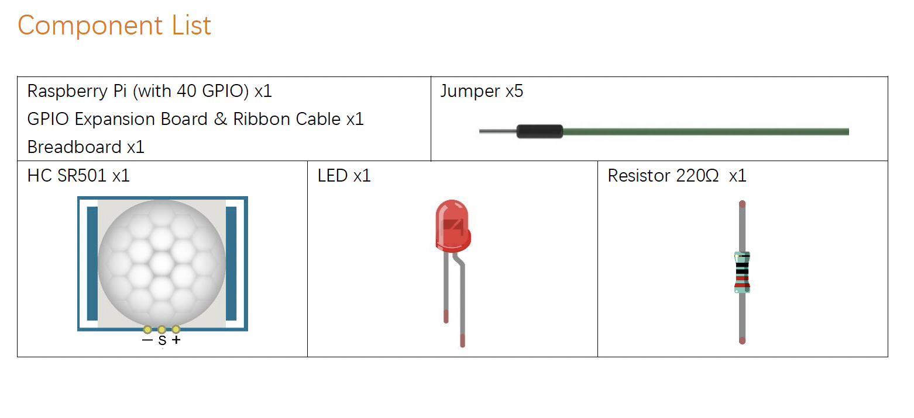
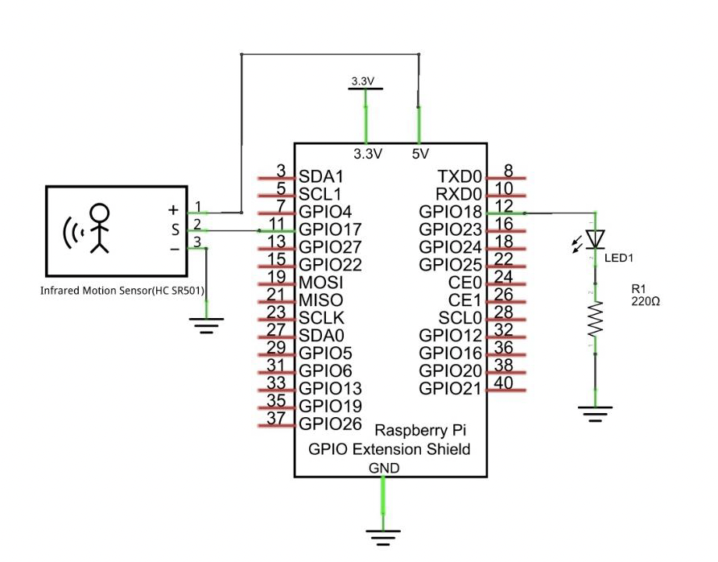
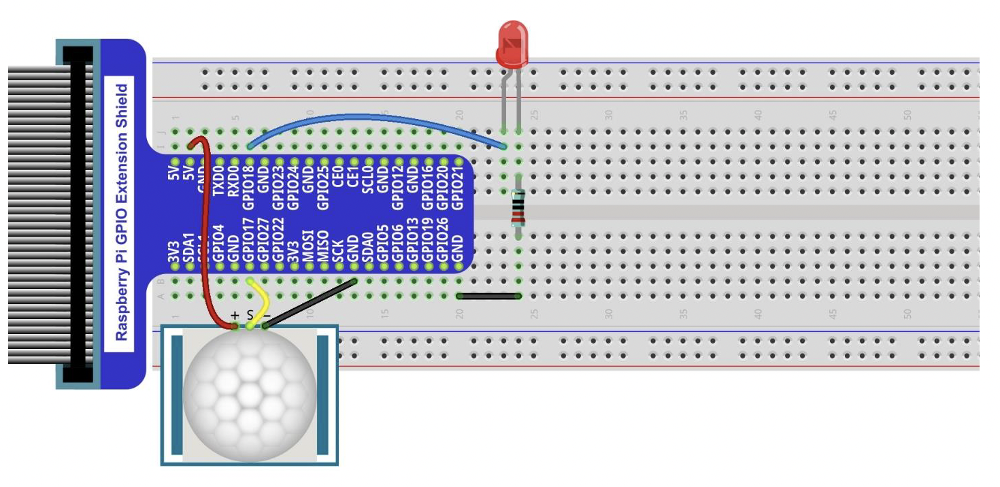

# Sensor de Movimiento

El proyecto Sensor de Movimiento forma parte del programa IoT4Kids y está diseñado para introducir a los estudiantes en el uso de sensores electrónicos aplicados a sistemas inteligentes. En este proyecto, los participantes aprenden a utilizar un sensor de movimiento PIR (Infrarrojo Pasivo) para detectar la presencia de personas u objetos en movimiento dentro de un área determinada.

El sensor se conecta a una placa microcontroladora (como Arduino o Raspberry Pi), y puede activar diferentes respuestas automáticas: encender una luz LED, emitir una señal sonora, enviar una notificación o incluso activar una cámara o sistema de seguridad. Los estudiantes también pueden programar condiciones específicas para personalizar el comportamiento del sistema.

Este proyecto permite comprender cómo funcionan los sistemas de detección, y tiene aplicaciones reales en hogares inteligentes, alarmas de seguridad, ahorro energético y automatización de espacios. Además, fomenta habilidades en programación, electrónica básica y pensamiento creativo, haciendo del aprendizaje una experiencia práctica y significativa.

## Materiales



## Diagrama de el GPIO



## Diagrama de el Breadboard



# Lógica del Programa (Python)

```python
i#!/usr/bin/env python3
########################################################################
# Filename    : SenseLED.py
# Description : Control led with infrared Motion sensor.
# auther      : www.freenove.com
# modification: 2023/05/11
########################################################################
from gpiozero import LED,MotionSensor
import time

ledPin = 18       # define ledPin
sensorPin = 17    # define sensorPin
led    = LED(ledPin)     
sensor = MotionSensor(sensorPin)
sensor.wait_for_no_motion()
def loop():
    # Variables to hold the current and last states
    currentstate = False
    previousstate = False
    while True:
        # Read sensor state
        currentstate = sensor.motion_detected
        # If the sensor is triggered
        if currentstate == True and previousstate == False:
            led.on()
            print("Motion detected!led turned on >>>")
            # Record previous state
            previousstate = True
        # If the sensor has returned to ready state
        elif currentstate == False and previousstate == True:
            led.off()
            print("No Motion!led turned off <<")
            previousstate = False
        # Wait for 10 milliseconds
        time.sleep(0.01)

def destroy():
    led.close() 
    sensor.close()                     

if __name__ == '__main__':     # Program entrance
    print ('Program is starting...')
    try:
        loop()
    except KeyboardInterrupt:  # Press ctrl-c to end the program.
        destroy()
        print("Ending program")
```
